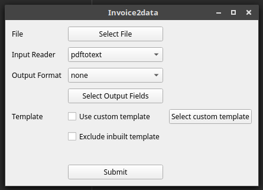

# guiInvoice2data

This repository tries to implement [invoice2data](https://github.com/m3nu/invoice2data).

**Note: It's an alpha version!**

## Dependencies
Make sure that PyQt5 and invoice2data module are installed

for PyQt-5:
```
pip3 install pyqt5
```
for invoice2data
```
pip3 install invoice2data
```

## Current Status
#### Things Working
 * Selecting File
 * Selecting input reader
 * Selecting output file type
 
#### Things coming soon
 * Selecting Custom templates
 * Selecting output Fields
 * Template creation
 
 